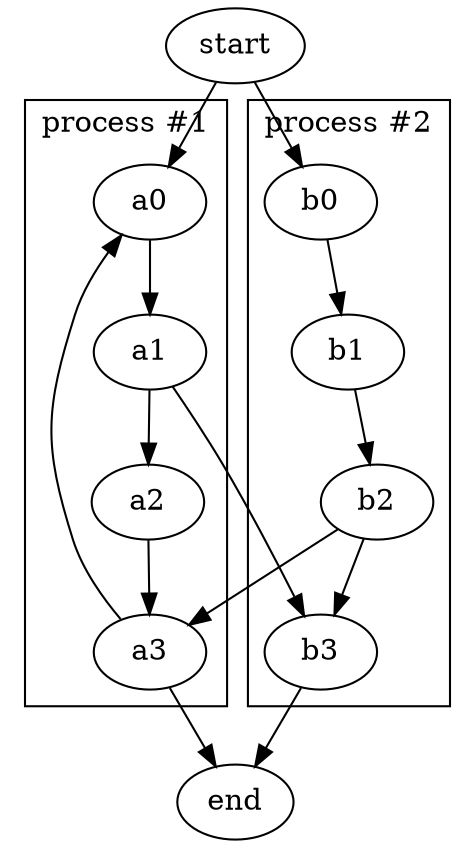

lookatme.contrib.grapheasy
==========================

This [lookatme](https://github.com/d0c-s4vage/lookatme) extension adds graph support to code blocks.

Setup
-----

__Prerequisites__

  - graphviz
  - graph-easy

__Installation__
  ```bash
  pip3 install lookatme.contrib.grapheasy
  ```
Usage
-----

Add grapheasy into the extensions header in your file:
```yaml
---
title: Making of The Pan Galactic Gargle Blaster
author: Zaphod Beeblebrox
date: 2022-01-25
extensions:
  - grapheasy
---
```
Then define some code blocks:

~~~markdown
# Graph::Easy

http://bloodgate.com/perl/graph/manual/

```grapheasy
[ Ol' Janx Spirit ] - to -> [ Santraginus V Water ]
```

---

# Graphviz

http://www.graphviz.org/



---

# VCG & GDL

Not tested but sopposedly supported by easy-graph:

- https://www.rw.cdl.uni-saarland.de/people/sander/private/html/gsvcg1.html
- https://www.absint.com/aisee/
~~~
